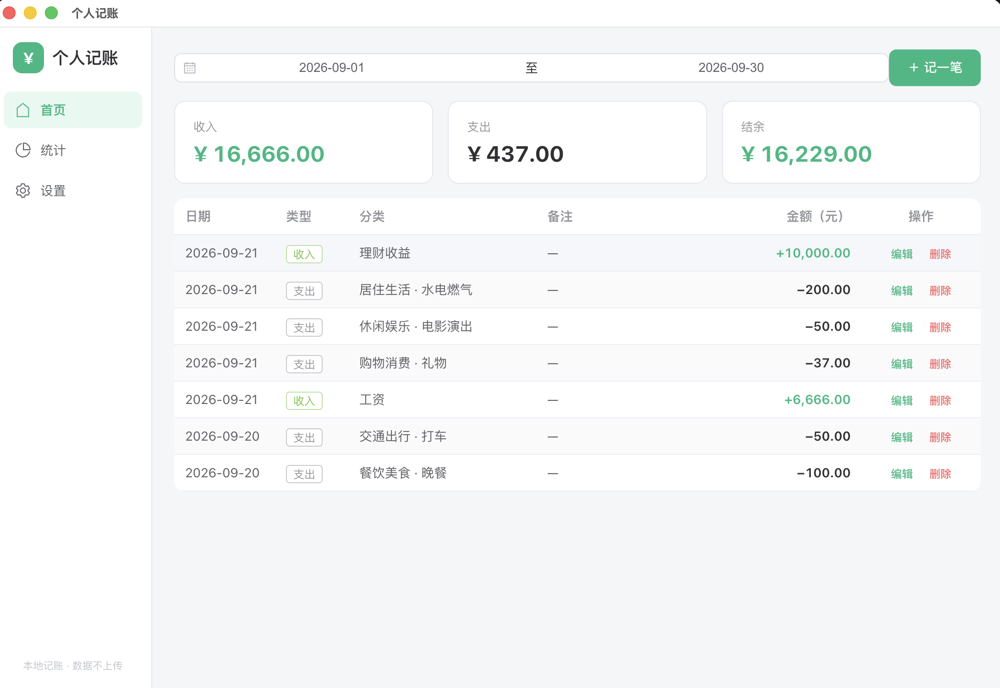
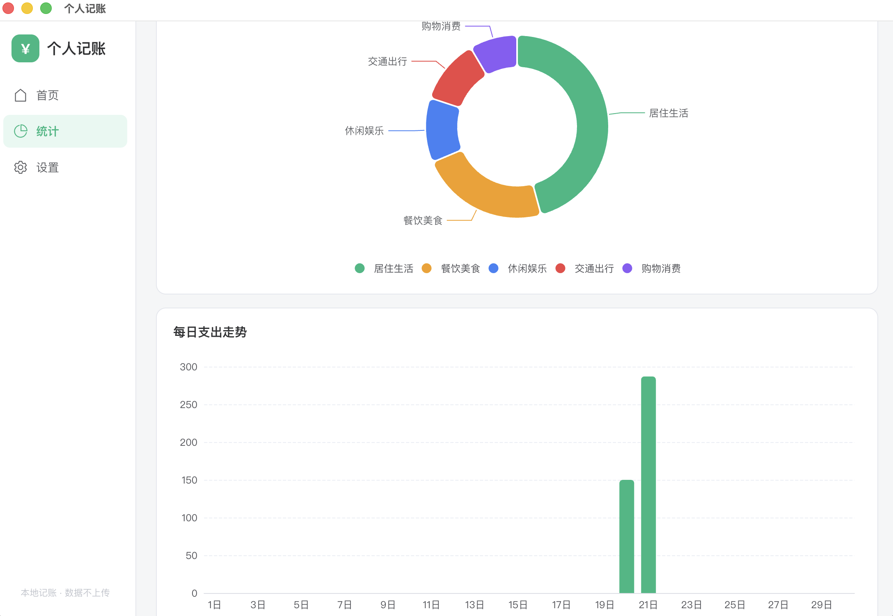
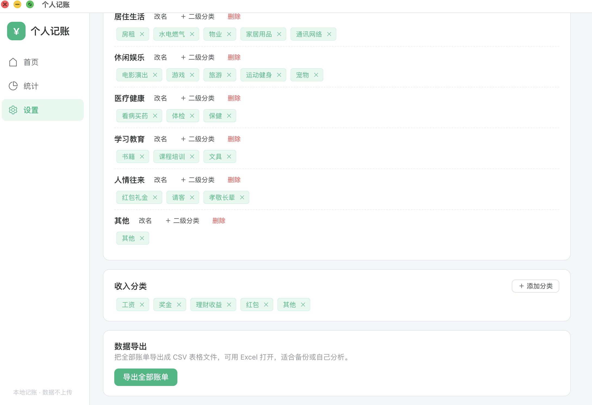

# 个人记账 · Personal Accounting

**跨平台桌面记账软件 —— 简单、离线、安全**
*A cross-platform desktop expense tracker — simple, offline, and secure.*

支持 macOS 与 Windows ｜ Available on macOS & Windows

## 项目简介 · About

「个人记账」是一款运行在 Windows 和 macOS 上的桌面记账软件：随手记录每一笔支出与收入，自动统计每月收支，并用图表直观呈现消费结构。所有数据保存在你自己的电脑上，不联网、不上传，安全放心。

*"Personal Accounting" is a desktop expense tracker for Windows and macOS. Jot down every expense and income, get automatic monthly summaries, and see your spending structure in intuitive charts. All data stays on your own device — offline by design, nothing is uploaded.*

本项目由一位**人工智能专业学生**借助 AI 编程工具 **Claude Code** 独立完成，覆盖从需求分析、产品设计、界面开发到双平台安装包发布的完整流程（详见下文「AI 辅助开发」）。

*This project was independently delivered by an AI-major student with the assistance of Claude Code — covering the entire lifecycle from requirements analysis and product design to cross-platform packaging and release (see "AI-Assisted Development" below).*

## 界面预览 · Screenshots

| 首页 · Home | 记一笔 · Add Record | 统计 · Statistics | 设置 · Settings |
| :---: | :---: | :---: | :---: |
|  |  |  |  |

## 功能 · Features

| 功能 · Feature | 说明 · Description |
| --- | --- |
| 💰 记一笔 | 支出 / 收入均可记录；金额精确到分，日期默认今天，可加备注 |
| 🗂️ 两级分类 | 9 个一级大类 + 40 余个二级小类（餐饮、交通、购物…），可在软件内自行增删改 |
| 📅 日期范围筛选 | 按任意时间段查询账单，同时显示该期间收入 / 支出 / 结余合计 |
| 📊 月度统计图表 | 支出分类占比环形图 + 每日支出柱状图，消费结构一目了然 |
| ✏️ 编辑 / 删除 | 任何一笔历史账单都可以修改或删除 |
| 📤 CSV 导出 | 账单数据一键导出为表格文件，可用 Excel 打开 |

| Feature | Description |
| --- | --- |
| 💰 Expense & income tracking | Precise to the cent; date defaults to today; optional notes |
| 🗂️ Two-level categories | 9 main categories + 40+ subcategories (food, transport, shopping…), fully customizable in-app |
| 📅 Date-range filtering | View transactions for any period with running income / expense / balance totals |
| 📊 Monthly analytics | Category-share donut chart + daily-expense bar chart |
| ✏️ Edit & delete | Modify or remove any past transaction |
| 📤 CSV export | One-click export to a spreadsheet file readable by Excel |

## 技术栈 · Tech Stack

| 技术 · Technology | 用途 · Purpose |
| --- | --- |
| Electron | 跨平台桌面应用框架（macOS / Windows） |
| Vue 3 + TypeScript | 界面开发（组合式 API，类型安全） |
| Element Plus | 中文生态成熟的 UI 组件库 |
| ECharts | 统计图表 |
| SQLite | 本地数据存储（单文件数据库，WAL 模式） |
| electron-builder | 打包 .dmg / .exe 安装包 |

## AI 辅助开发 · AI-Assisted Development

本项目是「一名 AI 专业学生 + AI 工具高效交付完整产品」的一个真实案例：

- **产品决策在人，实现交给 AI**：作者为自己定下并全程遵守一条协作规则——任何技术方案必须由 AI 列出多个候选、用通俗语言解释优劣，最终由人来拍板。项目的每一项技术选型（桌面框架、界面方案、数据存储…）都有据可查。
- **完整闭环**：从产品需求文档（PRD）、两级分类体系设计、3 轮基于反馈的界面迭代，到双平台安装包与面向非技术用户的操作指南，全部一人完成。
- **真实可运行**：项目已打包为 macOS（.dmg）与 Windows（.exe）安装包，双击即可安装使用。

*This project is a real-world case of "an AI-major student + AI tools shipping a complete product":*

- *Product decisions by the human, implementation by AI: the author established a collaboration rule followed throughout the project — every technical decision must be presented by AI as multiple options in plain language, with the final call made by the human. Every tech choice (desktop framework, UI approach, storage…) is documented.*
- *Full lifecycle by one person: PRD, category system design, 3 rounds of feedback-driven UI iteration, cross-platform installers, and end-user guides.*
- *Real and runnable: packaged as macOS (.dmg) and Windows (.exe) installers — double-click to install.*

## 快速开始 · Getting Started

需要 Node.js 20+（开发环境）。*Requires Node.js 20+ for development.*

```bash
npm install          # 安装依赖 · install dependencies
npm run dev          # 开发模式运行 · run in dev mode
npm run build:mac    # 打包 macOS 安装包（.dmg）
npm run build:win    # 打包 Windows 安装包（.exe，需在 Windows 上执行）
```

> 中国网络环境下依赖已配置 npmmirror 镜像，`npm install` 通常不会慢。
> *In mainland China, npmmirror mirrors are pre-configured so `npm install` is usually fast.*

## 项目结构 · Project Structure

```
├── src/
│   ├── main/          # Electron 主进程：数据库、文件读写、IPC
│   ├── preload/       # 安全桥接层（contextBridge）
│   ├── renderer/      # 界面（Vue 3 + Element Plus + ECharts）
│   └── shared/        # 前后端共享的类型定义
├── docs/              # 产品文档与使用指南
├── scripts/           # 构建辅助脚本（应用图标生成等）
├── resources/         # 应用图标等资源
└── package.json       # 依赖与打包配置
```

## 关于作者 · About the Author

人工智能专业在读学生（Universiti Malaya），当前正在寻找产品 / 技术方向的机会，欢迎通过 GitHub 联系交流。

*An undergraduate in Artificial Intelligence at Universiti Malaya, currently seeking opportunities in product/tech roles. Feel free to reach out via GitHub.*
